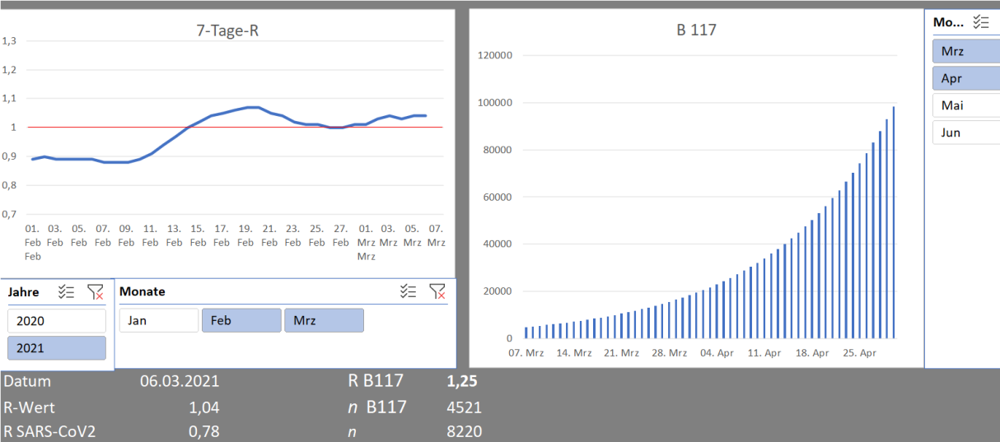

# RKI

Use update all within Dashboard.xlsx to scrape the current estimates for the number of active coronavirus cases in Germany,
as well as the current estimates for the basic reproduction number R.
Source: https://www.rki.de/DE/Content/InfAZ/N/Neuartiges_Coronavirus/Projekte_RKI/Nowcasting.html

These estimates are scraped using Power Query, a forecast for B117 is calculated and then visualized within the dashboard:
  1. A line graph plots the developement of the basic reproduction number R over time (7-day-average based on all confirmed cases). 
  2. A bar chart that plots the growth in case numbers for the B117 (Kent Variant) within Germany over time.
  
**Note:** This is a very simple proof of concept project and not a publication that meets scientific standards.
But it is accurate enough to get a feel for the trajectory of the pandemic and to communicate it to relatives and/or friends. After all sometimes a picture is worth more than a thousand words. And somehow the key message is often lost within complexity of dashboards like the one from RKI. The breakdown of case numbers to a local level is more than a little bit misleading. Then again, the trajectory isn't exactly stable due to the underlying data being reported infrequently.

**How to use:**
Filters can be applied from within the Dashboard.
The Forecast is highly reliant on how many of the total coronavirus cases are from B117, this value can be changed in cell C28 ("Anteil B117").
B117 is assumend to be 60% more infectuous compared to the original strain - this value can be changed C29 ("Mutantenfaktor").

Alternatively you can use the rki.py to get the relevant data. 
This might be easier because the RKI keeps changing their column names in unpredictable way, which breaks Power Query. 
However, you'd need to rebuild the query or do the calculations and plotting directly within Python.
